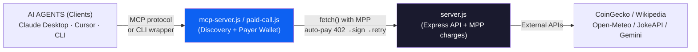

# 🚀 StellarAgentTools

Paid tool marketplace for AI agents using the Stellar Machine Payments Protocol (MPP).

Built for [Stellar Hacks: Agents 2026](https://dorahacks.io/hackathon/stellar-agents-x402-stripe-mpp)

---

## 🎯 What is this?

StellarAgentTools is an open-source infrastructure that lets AI agents (Claude Desktop, Cursor, Claude Code, etc.) automatically discover and pay for tools using the **Machine Payments Protocol (MPP)** on the **Stellar** blockchain.

- ~5s finality
- ~$0.00001 fees per transaction
- Native USDC via Soroban SAC (Stellar Asset Contract)
- Official machine-to-machine payments with MPP

## 🏗️ Architecture



## 🔧 Available Tools

All tools are priced in USDC on the Stellar Testnet. Prices are enforced by the API server using the Machine Payments Protocol.

| Endpoint | Description | Price | Source API |
|----------|-------------|-------|------------|
| `GET /tools/crypto-price` | Real-time crypto prices (`symbol`) | **0.005 USDC** | CoinGecko |
| `GET /tools/wiki-summary` | Wikipedia article summaries (`topic`, `lang`) | **0.01 USDC** | Wikipedia REST API |
| `GET /tools/country-info` | Comprehensive country data (`name`) | **0.005 USDC** | RestCountries |
| `GET /tools/random-joke` | Random jokes in various languages (`lang`) | **0.001 USDC** | JokeAPI v2 |
| `GET /tools/dad-joke` | Dad jokes, optionally by topic (`search`) | **0.001 USDC** | icanhazdadjoke |
| `GET /tools/weather` | Real-time weather (`city`, `lat`, `lon`) | **0.005 USDC** | Open-Meteo |
| `GET /tools/exchange-rate` | Real-time fiat exchange rates (`from`, `to`) | **0.003 USDC** | ExchangeRate API |
| `GET /tools/generate-image`| AI Image generation (`prompt`) | **0.05 USDC** | Google Gemini (Nano Banana) |
| `GET /tools` | Lists all available tools | **FREE** | Internal |

## 💡 How it works

1. Agent connects to the MCP server to discover available tools.
2. When a tool is invoked, the HTTP API server responds with **HTTP 402** (Payment Required) and the USDC price.
3. The MPP client wrapper (`Mppx` polyfill) intercepts the 402, builds, and signs a Soroban SAC `transfer` on Stellar using the agent's wallet in `.env`.
4. The client retries the request with the signed credential.
5. The server validates the payment on the blockchain and returns the tool result (HTTP 200).
6. All in seconds, autonomously, without API keys.

---

## 🚀 Quick start

### Prerequisites

- [Node.js](https://nodejs.org/) 20+
- A Stellar wallet with testnet USDC ([create here](https://lab.stellar.org/account/create))

### 1. Clone and install

```bash
git clone https://github.com/SEU_USUARIO/stellar-agent-tools.git
cd stellar-agent-tools
npm install
```

### 2. Configure environment

Create a `.env` file in the root:

```env
STELLAR_RECIPIENT=G...      # Receiver wallet (Merchant)
STELLAR_SECRET=S...         # Agent wallet secret (Payer)
MPP_SECRET_KEY=strong-mpp-secret-abc
GOOGLE_AI_KEY=AIza...       # Google Gemini API Key
PORT=3000
SERVER_URL=http://localhost:3000
```

### 3. Fund your agent wallet

A set of helper scripts are provided:

```bash
# Generate a new Payer wallet (S...) and fund with XLM for transaction fees
node skills/stellar-agent-tools/scripts/create-wallet.js --friendbot

# Check your agent wallet balance
node skills/stellar-agent-tools/scripts/check-balance.js
```
To pay for the tools, your wrapper needs **USDC**. Head to [https://faucet.circle.com](https://faucet.circle.com), choose **Stellar Testnet**, and transfer some USDC to your agent's public key (G...).

### 4. Run the API Server

> [!IMPORTANT]
> The API server must be running to process requests and enforce 402 payments.
> **Note:** Make sure it runs on **Port 3000** (as set in `.env` default configs) otherwise the UI and clients won't reach the API endpoints correctly.

```bash
node server.js
```

### 5. Autonomous Agent Integrations

#### A) GUI Agents (Claude Desktop, Cursor)
Integrate the tools seamlessly via **MCP (Model Context Protocol)**. Add this to your MCP configuration file:

```json
{
  "mcpServers": {
    "stellar-agent-tools": {
      "command": "node",
      "args": ["mcp-server.js"],
      "cwd": "/path/to/stellar-agent-tools"
    }
  }
}
```

#### B) CLI Agents (Codex, Custom Agents)
CLI agents can read the `skills/stellar-agent-tools/SKILL.md` file for instructions. They use the provided wrapper script to autonomously execute the 402 flow:

```bash
node skills/stellar-agent-tools/scripts/paid-call.js /tools/crypto-price symbol=xlm
```

#### C) Headless Testing
Run the client test script to sequentially run through all 8 paid tools and watch the autonomous payment flow in action:

```bash
node client.js
```

---

## 🗂️ Repo layout (backend + web)

- `server.js` — The Express API server charging MPP for tools
- `client.js` — A headless tester for the full MPP flow
- `mcp-server.js` — The MCP wrapper server for UI-based agents
- `skills/` — The autonomous CLI agent script wrappers and SKILL.md definition
- `app/` — Optional Next.js 16 frontend (App Router, Tailwind)
  - `npm run web:dev` to run frontend
  - `npm run web:build` / `npm run web:start` to build/preview

## 🛠️ Tech stack

- **Runtime**: Node.js 20+
- **Server**: Express.js
- **Payments**: MPP via `@stellar/mpp`
- **Blockchain**: Stellar Testnet (Soroban SAC)
- **Currency**: USDC (testnet)
- **Agent protocol**: MCP via `@modelcontextprotocol/sdk`
- **MPP framework**: `mppx`

## 📊 Cost comparison

| Property | MCPay (EVM) | Stellar MPP (this project) |
|---|---|---|
| Chain | EVM (Base, etc.) | Stellar |
| Payment protocol | x402 | MPP |
| Finality | ~2–15s | ~5s |
| Typical fees | ~$0.001 | **~$0.00001** |

## 🗺️ Roadmap

- [x] MPP server with paid tools
- [x] Test client with automatic payment
- [x] MCP server for agent integration
- [x] Autonomy wrapper for CLI agents (Codex, etc.)
- [ ] Web dashboard with transaction history
- [ ] MPP Session mode (off-chain channel)
- [ ] Public tool registry
- [ ] On-chain reputation via Soroban

## 📜 License

MIT

## 🏆 Hackathon

Built for [Stellar Hacks: Agents 2026](https://dorahacks.io/hackathon/stellar-agents-x402-stripe-mpp) by the Stellar Development Foundation.

**Hackathon tech used:**
- ✅ Stellar Testnet
- ✅ MPP (Machine Payments Protocol)
- ✅ USDC via Soroban SAC
- ✅ MCP (Model Context Protocol)
- ✅ Autonomous AI agents
